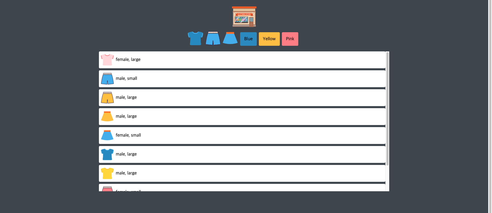

# Shopping Mall Application

About Project: Vanilla JS를 중점적으로 활용한 프로젝트입니다. 쇼핑몰 메인 로고를 클릭하면 전체적인 옷들이 나타나고 6개의 각각의 버튼을 클릭했을때 버튼의 종류별로 옷들이 나타납니다. CROS 이슈로 local에서 실행시 open with live server를 이용하여 결과 확인이 가능합니다.

JS 파트 프로젝트 진행과정

1. data.json을 fetch하여 items 배열을 얻습니다.
2. JS DOM과 map, join을 이용해서 각각의 item들이 포함된 li들을 모두 합친 문자열을 html의 ul안에 넣어줍니다.
3. 따라서 처음 화면에 모든 item들이 나타나게 됩니다.
4. buttons와 logo에 addEventListener(click)를 적용하였습니다.
5. button을 클릭한 event에서 dataset.key와 dataset.value를 얻어서 filter를 통해 item[key]와 value가 같은 item들로 이루어진 배열을 얻을 수 있습니다.
6. 이를 통해서 얻은 배열을 위의 2-3과 같은 과정으로 진행하여 유저가 클릭한 버튼에 알맞은 종류의 옷들로 구성된 화면이 나타납니다.

# 실행 결과 화면

